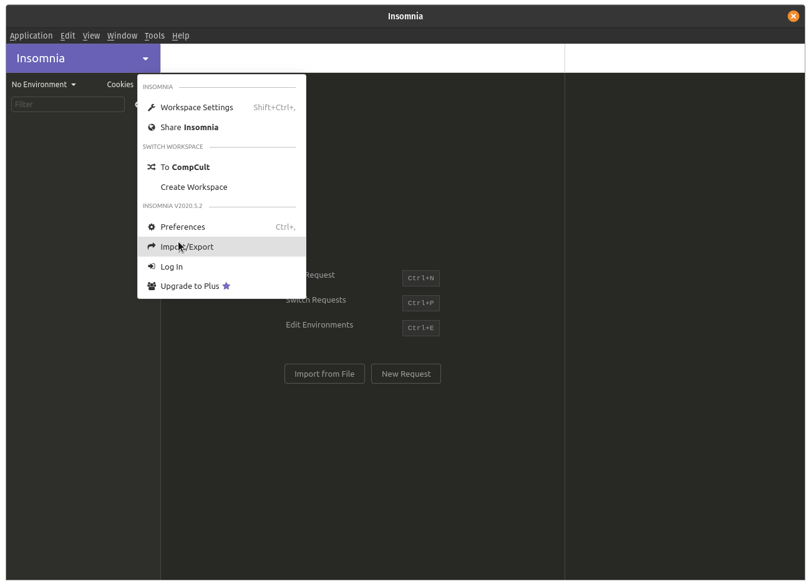
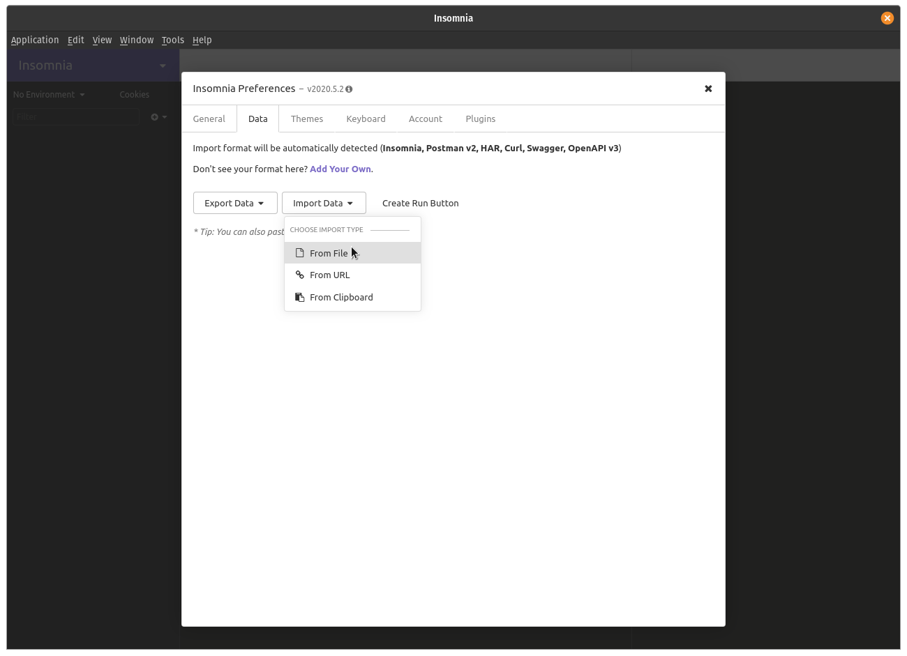
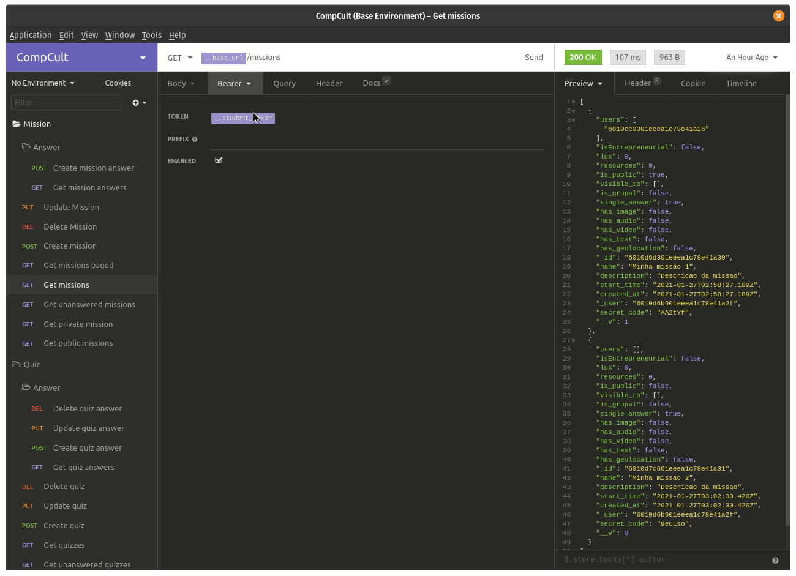
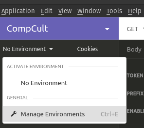
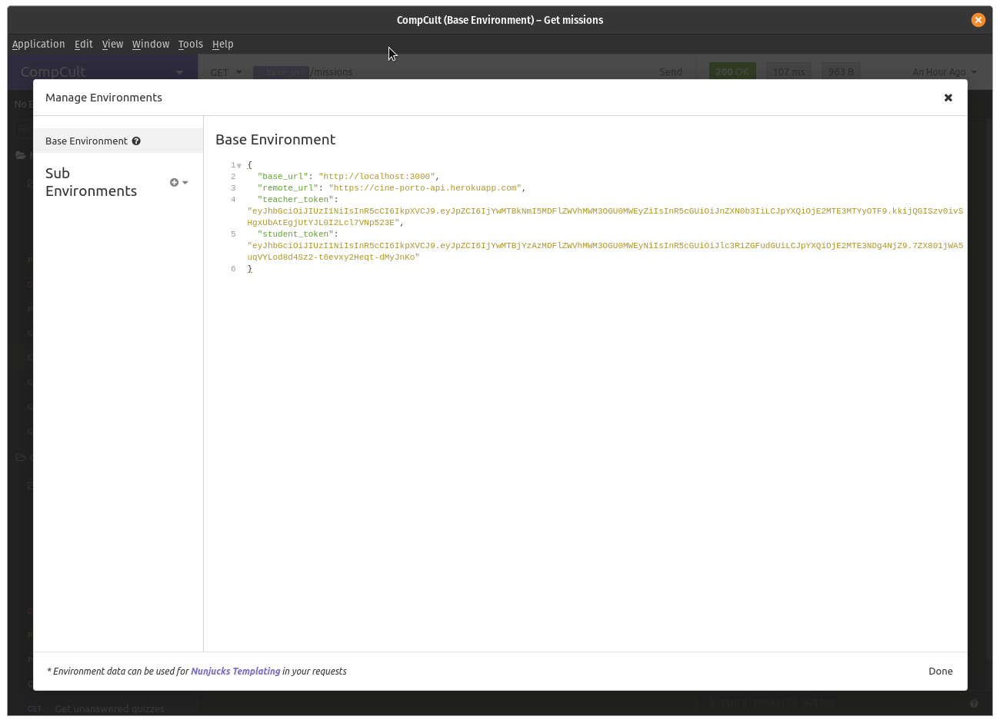

# CompCult API

## Para utilizar esta documentação, primeiro instale o [Insomnia](https://insomnia.rest/download/core/)

### No Insomnia navegue até a opção Import/Export

### E então importe from file e selecione o arquivo `insomnia_workspace.json` localizado nesta pasta

### Agora voçê terá acesso as rotas da api

### Para modificar as variáveis, basta ir em `Manage Environments`:

